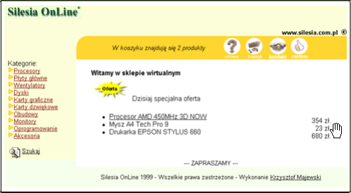

# E-Shop  
**Internetowy System Handlu Elektronicznego (E-Commerce Platform)**

  
  
  
  

**Sklep internetowy**  –  oprogramowanie (aplikacja internetowa) umożliwiająca 
realizację handlu elektronicznego. Zbudowana jest z dwóch modułów. Pierwszy 
przeznaczony jest dla kupujących (internatów), drugi dla administratora zarządzającego 
sklepem internetowym. Dane o produktach grupowane są w kategorie. Kupujący może 
wybrać daną grupę produktów lub wyszukać za pomocą modułu wyszukiwania. Każdy 
produkt opisany jest przez kod, nazwę, cenę (w tym stawkę VAT), jednostkę miary, oraz 
cechy dodatkowe. Cechami mogą być własności (promocja / bez promocji) lub 
określające cechy fizyczne produktu np. kolor. Każdy produkt może mieć dołączony 
obrazek i opis produktu. Moduł wyszukiwania umożliwia odnalezienie szukanych 
produktów. Kupujący może zadać złożone zapytanie składających się z wyrażeń. 
Odnalezione produkty wyświetlane są w postaci listy oraz dodatkowo przypisana jest 
grupa, do której należą. Moduł operatora umożliwia zarządzanie kontrahentami, 
zamówieniami oraz listą wysyłkową. Zamówienia rejestrowane są w systemie oraz 
dodatkowo wysyłane do operatora pocztą elektroniczną z możliwością automatycznego 
wysłania na telefon komórkowy w postaci SMS. Oprogramowanie zostało napisane w 
technologii pudełkowej. 

## 📦 Charakter projektu

- aplikacja internetowa,
- rozwiązanie pudełkowe (box product),
- możliwość wdrożenia u wielu odbiorców,
- przygotowana pod dalszą rozbudowę funkcjonalną.
