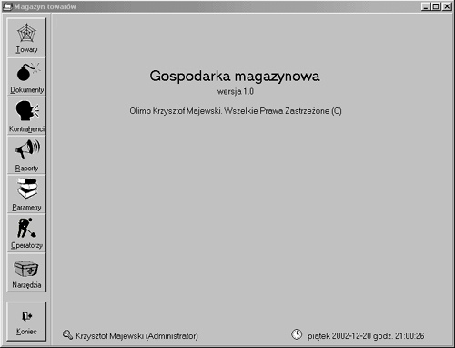

# Gospodarka magazynowa wer. 1
magazyn, produkcja, dzierżawa

  
  
  
  

**Gospodarka magazynowa** – to oprogramowanie umożliwiające zarządzanie gospodarką
magazynową w firmie. Cechą charakterystyczna jest sposób definiowania towaru.
Każdy towar składa się z paczek. Paczki można rozchodować w całości lub w części.
W programie dostępny jest rejestr kontrahentów, towarów, dokumentów i operatorów.
Do dokumentów zaliczamy:
- PZ (przyjęcia z zewnątrz),
- WZ (wydania na zewnątrz),
- REZ (rezerwacje).

Proces rezerwacji dzieli się na rezerwację wstępną i zasadniczą. Rezerwacja wstępna
jest informacją o przeznaczeniu towaru, ma charakter informacyjny. Rezerwacja zasadnicza
jest procesem podobnym do definiowania dokumentów WZ. W programie dostępne są raporty
umożliwiające utworzenie zestawień: rezerwacji, wstępnej rezerwacji, obrotów, stanu
towarów. Raporty posiadają możliwości ograniczenia liczby danych poprzez określenie
zakresu danych. Z rejestru kontrahentów dostępne są informacje dotyczące towarów danego
kontrahenta (przyjęte lub wydane) oraz ich historia. Z rejestru towarów dostępne są
informacje dotyczące przyjęcia lub wydania towaru (w pozycjach dokumentu występuje
dany towar), oraz jego historia.
Oprogramowanie przeznaczone jest do pracy, jednostanowiskowej lub wielostanowiskowej.

Pełny opis znajduje się w [Magazyn1 dokumentacja programu.pdf](Magazyn1%20dokumentacja%20programu.pdf)

[🔙 Powrót do README](../../../README.md)