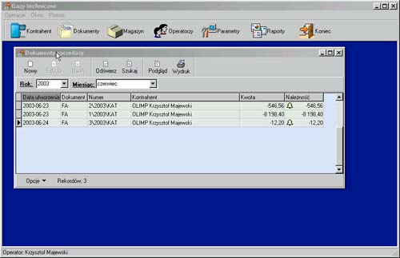

# Gospodarka magazynowa wer. 2
magazyn, produkcja, dzierżawa

  
  
  
  

**Gospodarka magazynowa** – to oprogramowanie umożliwiające zarządzanie gospodarką magazynową w firmie.
Pozycje magazynowe (towary lub usługi), przechowywane są w magazynach. Towar (pozycja magazynowa) może być złożona
(wymaga produkcji) lub prosta. Towar może mieć przypisaną własność dzierżawy. Towary posiadające tą własność mogą
być dzierżawione. Proces dzierżawy składa się z trzech elementów:
1. wydanie towarów dzierżawy,
2. zwrot,
3. naliczenie (wystawienie dokumentu faktura za świadczoną usługę dzierżawy).

Dokumenty w systemie zostały podzielone na 3 kategorie:
- dokumenty obiegu wewnętrznego,
- zakupu
- sprzedaży.

Do dokumentów obiegu wewnętrznego zaliczamy;
- PZ (przyjęcie z zewnątrz),
- WZ (wydanie na zewnątrz),
- PW (przychód wewnętrzny),
- RW (rozchód wewnętrzny),
- MM- (przesunięcie magazynowe – wydanie),
- MM+ (przesunięcie magazynowe – przyjęcie).

Dokumenty obiegu wewnętrznego wpływają na stan magazynu. Do dokumentów zakupu i sprzedaży zaliczamy dokument FA.
Dokumenty te są dokumentami kasowymi (wpływają na stan rozrachunków), natomiast nie wpływają na stan magazynu.
Każdy dokument może posiadać status dokumentu otwartego lub zamkniętego. Proces zamknięcia jest procesem nieodwracalnym.
Wpływa na stan magazynu i rozrachunków.

Oprogramowanie przeznaczone jest do pracy jednostanowiskowej lub wielostanowiskowej.

Pełny opis znajduje się w [Magazyn2 dokumentacja programu.pdf](Magazyn2%20dokumentacja%20programu.pdf)

[🔙 Powrót do README](../../../README.md)