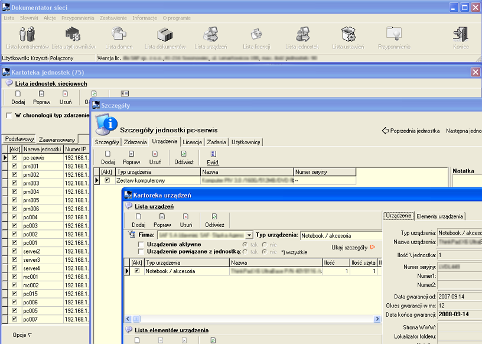

# Dokumentator
*zarządzanie sprzętem komputerowym, użytkownikami, domenami, współpraca z Active Directory, stacjami roboczymi*

  
  
  
  

**Dokumentator** – oprogramowanie wspomaga zarządzanie serwerami z zainstalowanym oprogramowaniem Windows serwer.
Umożliwia zarządzenie dokumentami, sprzętem, oprogramowaniem, gwarancjami, ustawieniami, domenami. Tworzy kontenery
w ramach, których definiuje się jednostki – stacje robocze. Zarządza kontrahentami. Oprogramowanie umożliwia zarządzanie
całością w ramach jednej lub wielu firm. Tworzy raporty i zestawienia z gromadzonych danych. Umożliwia blokowanie dostępu
do danych w zależności od poziomu uprawnień. Umożliwia współpracę z Active Directory poprzez wykonanie skryptów zrealizowanych
poprzez ewidencję akcji.
Z oprogramowaniem dostarczany jest moduł instalowany na stacjach roboczych, który umożliwia podgląd ekranu, wysłanie wiadomości,
odczyt listy oprogramowania, odczyt zasobów sprzętowych w tym tablicy SMART dla dysków twardych

[🔙 Powrót do README](../../../README.md)