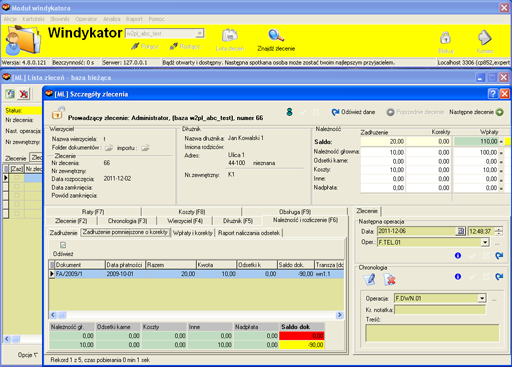
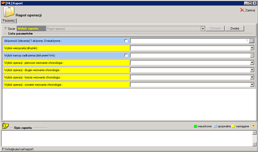

# Windykator
*obsługa windykacji masowej, eSądu, bankowych kont wirtualnych*

  
  
  
  

**System Windykator** – oprogramowanie umożliwia automatyzację procesu windykacji masowej (wyznacza zadań dla
operatorów na dany dzień, automatyzuje proces wybierania numeru – elementy Call Center, automatyzuje proces wydruku
dokumentów z pozycjonowanie kolejności pobierania papieru z podajników dla drukarek wielo podajnikowych, wydruków
pozycyjnych / milimetrowych, automatyzuje proces importu danych). Oprogramowanie ma budowę modułową (Windykator,
teren, sąd, administrator, wydruk, zarządca, rozliczenie itp.) Oprogramowanie jest wielo językowe.
Pracuje w oparciu o bazę Mysql. Ma wbudowany własny język formuł, które umożliwiają dostosowanie danych zewnętrznych
(import danych) i wewnętrznych (wydruk danych) oraz posiada wbudowanego zarządcę danych. System raportowy (umożliwia
on szybkie tworzenie raportów). Moduły dostosowują oprogramowanie do pracy z różnymi kategoriami użytkowników (windykacja
sądowo / komornicza, windykacja terenowa, wierzyciele itp.).
Oprogramowanie dostosowane jest do pracy w środowisku wielostanowiskowym.

[🔙 Powrót do README](../../../README.md)