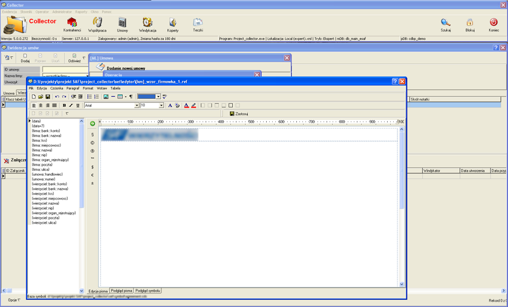
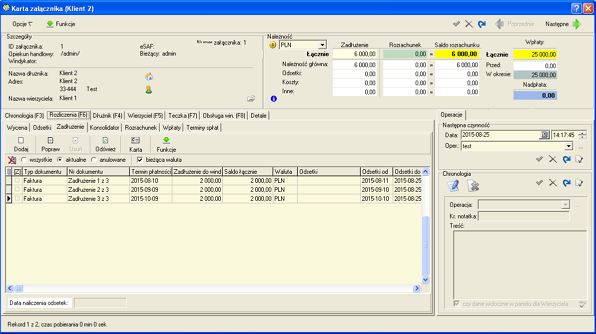

# Collector

  
  
  
  

**System Collector** – oprogramowanie wspomagające proces windykacji biznesowej i komorniczej. Umożliwia rejestrację
zdarzeń związanych z obsługą handlową, automatyzuje proces wybierania numeru poprzez CTI. Wspomaga proces podpisywania
umów i załączników, tworzenia dokumentów, rejestracji korespondencji pism w tym rejestrację kodów IR, tworzenie książki nadawczej.
Umożliwia rejestrację procesu windykacji, operacje na zadłużeniu w tym konsolidację, księgowanie zadłużenia, tworzenia dokumentów
na każdym etapie, rejestrację korespondencji wychodzącej oraz przychodzącej.
Oprogramowanie pracuje w oparciu o bazę Mysql. Ma wbudowany własny język formuł dostępnych z poziomu edytora pism, które umożliwiają
dostosowanie. Posiada wbudowanego zarządcę danych – system raportowy umożliwiający szybkie tworzenie raportów, z wbudowanym językiem
tworzenia raportów.

[🔙 Powrót do README](../../../README.md)