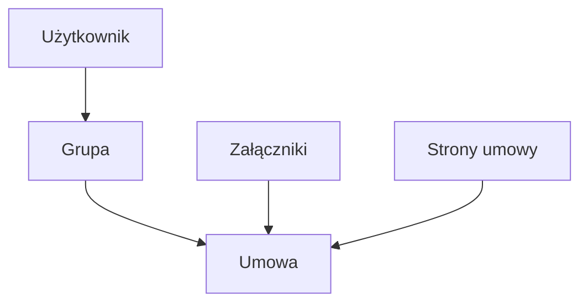

# UmowyDBV
**Enterprise Contract Archiving & Document Management System**

  
  
  
  
-orange)  
  

**UmowyDBV** to aplikacja desktopowa klasy **back-office**, przeznaczona do **centralnej archiwizacji umów handlowych** wraz z pełną ewidencją załączników, aneksów oraz stron umów.

System został zaprojektowany z myślą o **bezpiecznym, kontrolowanym dostępie do dokumentów** w organizacji o strukturze wielodziałowej (centrala, dystrybucja, sprzedaż), z naciskiem na **audytowalność, spójność danych oraz integrację z infrastrukturą domenową Windows**.

---

## 🔐 Autoryzacja i bezpieczeństwo

- Logowanie użytkowników odbywa się poprzez **Active Directory (Windows Authentication)**
- Brak lokalnych kont aplikacyjnych – system korzysta z poświadczeń domenowych
- Uprawnienia użytkowników wynikają z:
  - przynależności do **grup zabezpieczeń**,
  - pełnionej funkcji organizacyjnej (np. centrala / sprzedaż / dystrybucja)

**Model bezpieczeństwa:**
- separacja dostępu na poziomie **umowy i dokumentu**,
- jedna umowa może być przypisana do **wielu grup zabezpieczeń**,
- użytkownik widzi wyłącznie dokumenty zgodne z jego uprawnieniami.

---

## 🧩 Kluczowe funkcjonalności

### 1. Moduł Umów – centralna ewidencja dokumentów

Główny moduł systemu umożliwiający przegląd, filtrowanie i zarządzanie umowami.

### 2. Moduł Kontrahenci / Strony umów

Moduł prezentujący strony biorące udział w umowach.

### 3. Moduł Załączniki i aneksy

Obsługa dokumentów powiązanych z umowami.

---

### 4. Moduł Grup zabezpieczeń

Centralne zarządzanie dostępem do dokumentów. Przynależność użytkownika do grupy determinuje **prawo odczytu umowy - dokumentów**.

---

## 🧾 Digitalizacja i identyfikacja dokumentów

- Umowy były **skanowane do systemu**
- Każdemu dokumentowi nadawany był **unikatowy kod kreskowy**
- Kod kreskowy stanowił klucz identyfikacyjny dokumentu w systemie
- Umożliwiało to:
  - szybkie wyszukiwanie,
  - jednoznaczne powiązanie skanu z metadanymi,
  - minimalizację błędów operacyjnych.

---

## 🛠 Warstwa techniczna

### Architektura

- aplikacja desktopowa **C# / WinForms**,
- architektura wielowarstwowa,
- centralna baza danych **Microsoft SQL Server**,
- deployment poprzez **Microsoft ClickOnce**.

System został zaprojektowany jako **aplikacja transakcyjna**, z naciskiem na:
- integralność danych,
- stabilność,
- czytelność interfejsu dla użytkowników biznesowych.

---

## 📊 Schemat  

[🔙 Powrót do README](../../../README.md)