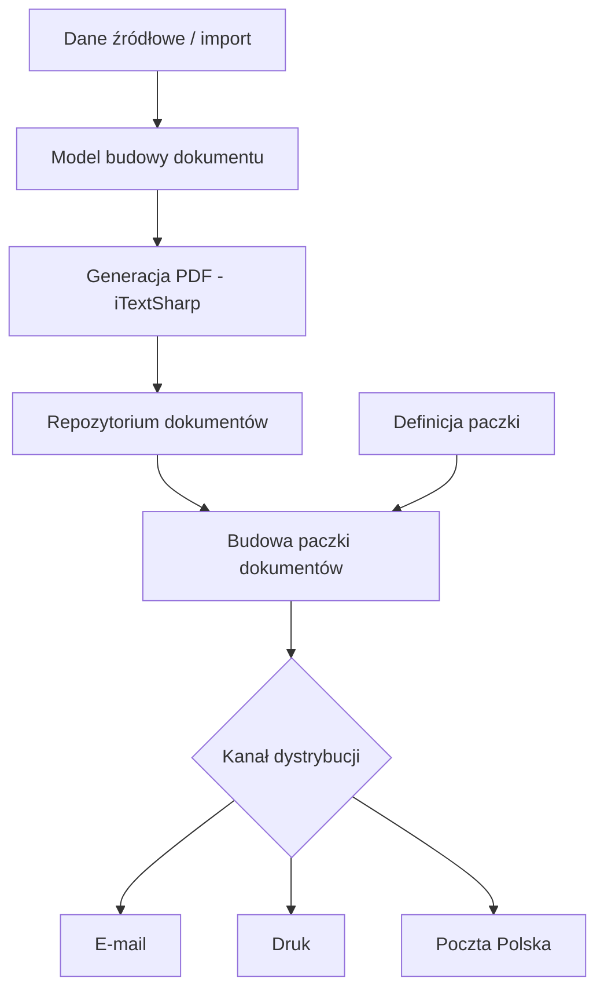

# Dokumenty SP
**Enterprise Document Generation & Distribution System**

  
  
-orange)  
  
  

**Dokumenty SP** to rozbudowany system klasy **back-office / enterprise**, służący do **automatycznego generowania, kompletowania oraz dystrybucji paczek dokumentów** w różnych kanałach komunikacji.

System obsługuje pełny cykl życia dokumentu:
od **importu danych i generacji PDF** → przez **budowę paczek dokumentów** → po **wysyłkę elektroniczną, druk lokalny lub nadanie przez Pocztę Polską**.

---

## 🔐 Autoryzacja i bezpieczeństwo

- Logowanie użytkowników odbywa się poprzez **Active Directory (Windows Authentication)**
- Dostęp do funkcjonalności oparty na tożsamości domenowej
- Pełna identyfikowalność operacji (kto, kiedy, w jakim kontekście)

---

## 🚀 Kluczowe funkcjonalności

### 1. Generacja dokumentów PDF

- Dokumenty tworzone są dynamicznie na podstawie:
  - danych importowanych z systemów źródłowych,
  - zdefiniowanych modeli budowy dokumentów.
- Wykorzystanie biblioteki **iTextSharp**:
  - generacja plików PDF,
  - kontrola układu, struktury i treści dokumentu.
- Obsługa dokumentów:
  - generowanych w systemie,
  - importowanych z zewnątrz.

---

### 2. Paczki dokumentów

- Dokumenty grupowane są w **paczki** zgodnie z definicjami biznesowymi:
  - jakie typy dokumentów mają się znaleźć w paczce,
  - w jakiej kolejności,
  - w jakim kanale dystrybucji.
- Jedna paczka może być:
  - wydrukowana,
  - wysłana e-mailem,
  - nadana jako przesyłka tradycyjna.

---

### 3. Wielokanałowa dystrybucja

System obsługuje równolegle kilka kanałów wysyłki:

- 📧 **E-mail** – pełna ewidencja wysłanych wiadomości wraz z dokumentami
- 🖨 **Druk lokalny** – rejestr wydruków i paczek przekazanych do druku
- 📮 **Poczta Polska** – ewidencja paczek nadanych tradycyjnie

Każdy kanał posiada niezależny rejestr i historię operacji.

---

### 4. Robot procesowy (Background Worker)

Dedykowany **robot systemowy** realizujący zadania automatyczne.

Podczas jednej sesji:
1. generuje dokumenty PDF,
2. buduje paczki dokumentów,
3. realizuje wysyłkę w zdefiniowanych kanałach.

Robot umożliwia:
- kontrolę przebiegu sesji,
- powtarzalność procesów,
- minimalizację błędów operacyjnych.

---

## 🧭 Moduły systemu (menu)

- **Dokumenty**
  Ewidencja dokumentów wraz z listą paczek, w których występują.

- **Paczki**
  Ewidencja paczek oraz dokumentów przypisanych do paczek.

- **Kontrahenci**
  Rejestr kontrahentów wraz z powiązanymi paczkami.

- **Wiadomości wysłane**
  Historia wysyłek e-mailowych z załączonymi dokumentami.

- **Dokumenty wydrukowane**
  Rejestr paczek przekazanych do druku.

- **Dokumenty nadane (Poczta Polska)**
  Ewidencja paczek wysłanych tradycyjną pocztą.

- **Raporty**
  Zestawienia wysyłek i dokumentów we wszystkich kanałach.

- **Robot**
  Panel kontroli i monitoringu pracy robota systemowego.

---

## 🛠 Warstwa techniczna

- **Frontend:** C# WinForms
- **Backend / Logika biznesowa:** C#
- **Baza danych:** Microsoft SQL Server
- **PDF:** iTextSharp
- **Autoryzacja:** Active Directory (Windows Authentication)

System zaprojektowany w architekturze modularnej, umożliwiającej dalszą rozbudowę procesów i kanałów dystrybucji.

---

## 📊 Schemat procesu – generacja i wysyłka paczki dokumentów

[🔙 Powrót do README](../../../README.md)