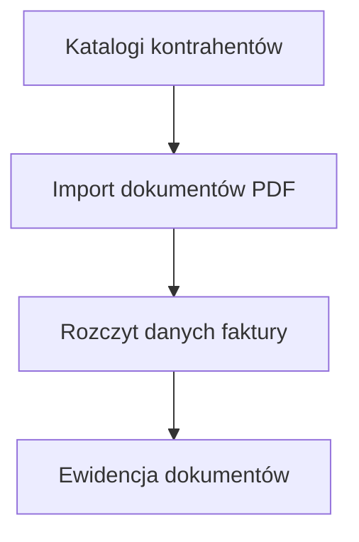

# Procesowanie DK
**System wspomagający import danych z faktur do SAP**

  
  
  
  
-lightgrey)  
  

---

## 📌 Opis systemu

**Procesowanie DK** to aplikacja desktopowa klasy **back-office**, wspierająca proces **przygotowania i importu danych z faktur zakupowych do systemu SAP**.
System automatyzuje rozczytywanie dokumentów PDF, normalizację danych oraz ich eksport do formatów akceptowanych przez systemy ERP.

Aplikacja została zaprojektowana jako narzędzie operacyjne dla działów finansowo-księgowych, obsługujących dużą liczbę dokumentów od zdefiniowanych kontrahentów.

---

## 🔐 Autoryzacja i bezpieczeństwo

- Logowanie użytkowników odbywa się poprzez **Active Directory (Windows Authentication)**
- Dostęp do funkcji aplikacji oparty jest o:
  - konto domenowe użytkownika
  - role i uprawnienia przypisane po stronie systemu
- Brak lokalnego przechowywania haseł
- Integracja z infrastrukturą bezpieczeństwa organizacji

---

## 🧩 Zakres funkcjonalny

### 1. Import i ewidencja dokumentów

Moduł odpowiedzialny za masowy import faktur w formacie PDF.

- Import dokumentów z katalogów nazwanych wg **ID kontrahenta**
- Automatyczne rozczytywanie kluczowych danych:
  - NIP
  - numer dokumentu
  - numer zamówienia
  - data wystawienia
  - waluta
  - kwota brutto
- Zapis danych w **Ewidencji dokumentów**
- Eksport do pliku **CSV** w strukturze akceptowanej przez **SAP**

📂 *Menu → Funkcje → Import danych*

---

### 2. Przetwarzanie dokumentów PDF

Rozbudowany zestaw narzędzi do operacji na dokumentach PDF.

- **Rozłupnik PDF wg wzorca**
  - automatyczny podział dużych plików PDF na mniejsze dokumenty
  - separacja na podstawie zdefiniowanego ciągu znaków
  - zapis wyników do wskazanego katalogu

- **Narzędzia PDF**
  - podział dokumentu na strony
  - łączenie dokumentów
  - konwersja obrazów do PDF

📂 *Menu → Funkcje → Narzędzia PDF*

---

### 3. Przygotowanie korespondencji rozliczeniowej

Moduł wspierający przygotowanie rocznych rozliczeń sald dla kontrahentów.

- Odczyt dokumentów z określonych folderów
- Automatyczne generowanie **dwóch plików Excel**:
  1. lista do wysyłki **e-mailowej**
  2. lista do wysyłki **pocztą tradycyjną**
- Dane gotowe do dalszego przetwarzania przez zewnętrzne systemy lub użytkowników biznesowych

📂 *Menu → Funkcje → Przygotowanie email do wysyłki*

---

## 🛠 Warstwa techniczna

- aplikacja desktopowa **C# / WinForms**,
- architektura wielowarstwowa,
- centralna baza danych **Microsoft SQL Server**,
- deployment poprzez **Microsoft ClickOnce**.

---

## 📊 Schemat procesu – import dokumentów

