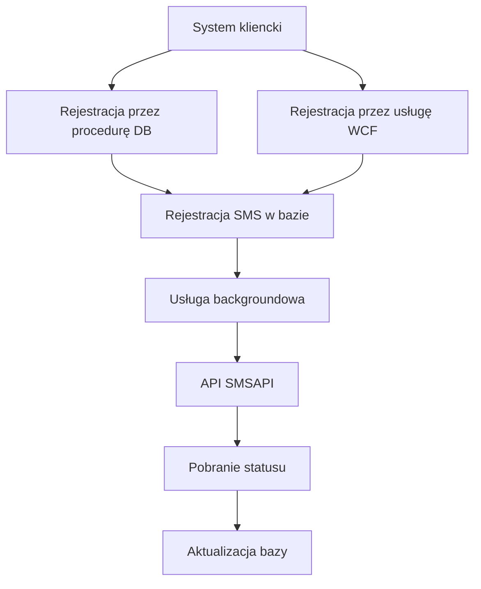

# UmowySp – Bramka SMS
**Enterprise SMS Gateway & Message Delivery Management System**

  
  
  
  
-orange)  
  

**Bramka SMS** to wewnętrzny system, zaprojektowany do **automatyzacji, kontroli kosztów oraz monitorowania masowej wysyłki wiadomości SMS** w organizacji.
Rozwiązanie pełni rolę centralnej bramki komunikacyjnej pomiędzy systemami biznesowymi (np. windykacyjnymi) a zewnętrznym dostawcą usług SMS.

System został zaprojektowany z naciskiem na:
- bezpieczeństwo,
- skalowalność,
- audytowalność,
- kontrolę kosztów wysyłki.

---

## 🔐 Autoryzacja i bezpieczeństwo

- Logowanie użytkowników realizowane poprzez **Active Directory (Windows Authentication)**
- Dostęp do funkcjonalności oparty o role i uprawnienia domenowe
- Klienci systemowi (aplikacje) identyfikowani poprzez **aktywne klucze API**
- Pełna rejestracja operacji (kto, kiedy, z jakiego źródła)

---

## 🧩 Architektura rozwiązania

System składa się z kilku logicznych komponentów:

- **Usługa backgroundowa**
  Odpowiada za:
  - komunikację z API dostawcy SMS,
  - wysyłkę wiadomości,
  - cykliczne pobieranie statusów doręczeń.

- **Aplikacja desktopowa (C# / Windows)**
  Narzędzie operacyjne do:
  - monitorowania wysyłek,
  - zarządzania blokadami (ręczne blokady numerów, historia blokad)
  - konfiguracji kluczy, limitów i wzorców treści (aktywność klucza, limity dzienne i miesięczne, godziny wysyłki, priorytety, statystyki dzienne i miesięczne),
  - zarządzanie wzorcami treśći sms(ów),
  - zlecenie wysyłki (możliwość użycia wzorców treści)

---

## 📡 Integracja z dostawcą SMS

Wysyłka realizowana była poprzez **SMSAPI** przy użyciu dostarczonego API.

### Mechanizm potwierdzeń (Delivery Reports)

System implementował **wielostopniowy retry policy** dla pobierania statusów doręczeń. Każda próba była rejestrowana wraz z licznikiem oraz planowaną kolejną próbą.

### Kontrola kosztów

- Koszt SMS liczony w punktach (zależny od długości wiadomości)
- Znaki specjalne liczone jako **2 znaki standardowe**
- Limity dzienne i miesięczne per klucz nadawcy
- Blokady numerów w celu eliminacji zbędnych kosztów

## 🗄 Warstwa danych

**MS SQL Server**

- procedury składowane,
- funkcje bazodanowe,
- transakcyjność,
- spójność danych pomiędzy usługą a UI.

Zlecenie wysyłki SMS(ów) może być rejestrowane:
- bezpośrednio w bazie (procedura składowana),
- przez aplikację desktopową,
- przez serwis WCF.

---

## 📊 Schemat procesu wysyłki SMS

[🔙 Powrót do README](../../../README.md)