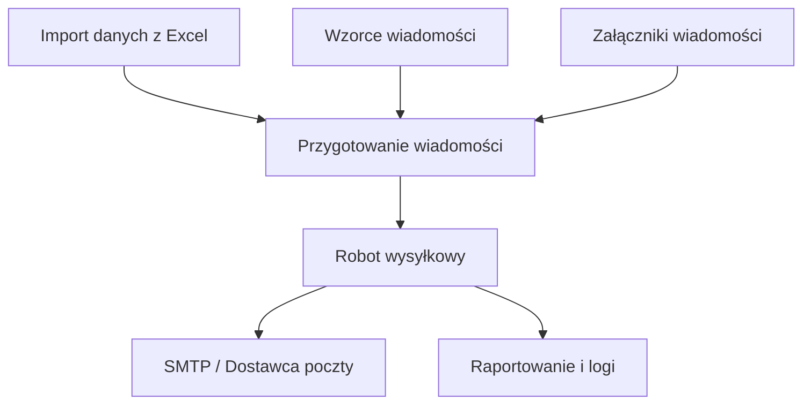

# Wysyłka Email
**Automated Bulk Email Delivery System**

  
  
  
-orange)  
  

**Wysyłka Email** to wewnętrzny system klasy **utility / back-office**, zaprojektowany do **automatyzacji masowej wysyłki wiadomości e-mail** z pełną kontrolą procesu, bezpieczeństwa oraz zgodnością z limitami dostawców poczty (np. Office 365).

Aplikacja została wdrożona jako narzędzie wspierające procesy operacyjne i komunikacyjne, eliminując ręczne wysyłki oraz ryzyko błędów ludzkich przy dużych wolumenach wiadomości.

🔐 **Autoryzacja i bezpieczeństwo**
- Logowanie użytkowników odbywa się poprzez **Active Directory (Windows Authentication)**
- Dostęp do aplikacji kontrolowany jest przez **grupy Active Directory**
- Uprawnienia użytkowników są mapowane centralnie po pierwszym logowaniu

---

## 🚀 Kluczowe funkcjonalności

### 1. Masowa wysyłka wiadomości e-mail
System umożliwia przygotowanie i realizację wysyłek e-mailowych w oparciu o dane importowane z plików Excel.

- planowanie wysyłki na określoną datę i godzinę,
- obsługa tysięcy wiadomości w jednej sesji,
- pełna kontrola nad kolejką wysyłki,
- możliwość natychmiastowego przerwania procesu.

---

### 2. System wzorców wiadomości
Wiadomości budowane są w oparciu o **wzorce**, które mogą być importowane z plików:
- `.msg` (Outlook),
- `.eml` (format uniwersalny).

- obsługa HTML (grafiki, formatowanie),
- załączniki statyczne i dynamiczne,
- personalizacja treści poprzez **zmienne** (`{zmienna}=wartość`).

---

### 3. Import danych (Excel)
Proces wysyłki rozpoczyna się od importu danych z plików Excel (XLSX).

- import zleceń wysyłki,
- dołączanie wielu załączników,
- definiowanie zmiennych per odbiorca,
- identyfikatory zleceń do integracji z systemami zewnętrznymi.

---

### 4. Robot wysyłkowy (Background Worker)
Za realizację wysyłki odpowiada robot działający w kontrolowanych sesjach.

- wysyłka w zadanych interwałach czasowych,
- respektowanie dziennych limitów dostawcy poczty,
- możliwość natychmiastowego zatrzymania procesu,
- integracja z **Harmonogramem Zadań Windows**.

---

## 🛠 Warstwa techniczna

- **C# / WinForms** – aplikacja konfiguracyjna (UI)
- **C# / Console App** – robot wysyłkowy
- **SQL Server** – ewidencja zleceń, statusów i logów
- **ClickOnce** – dystrybucja i automatyczne aktualizacje
- **Windows Authentication (Active Directory)**

---

## 📊 Schemat procesu wysyłki

[🔙 Powrót do README](../../../README.md)