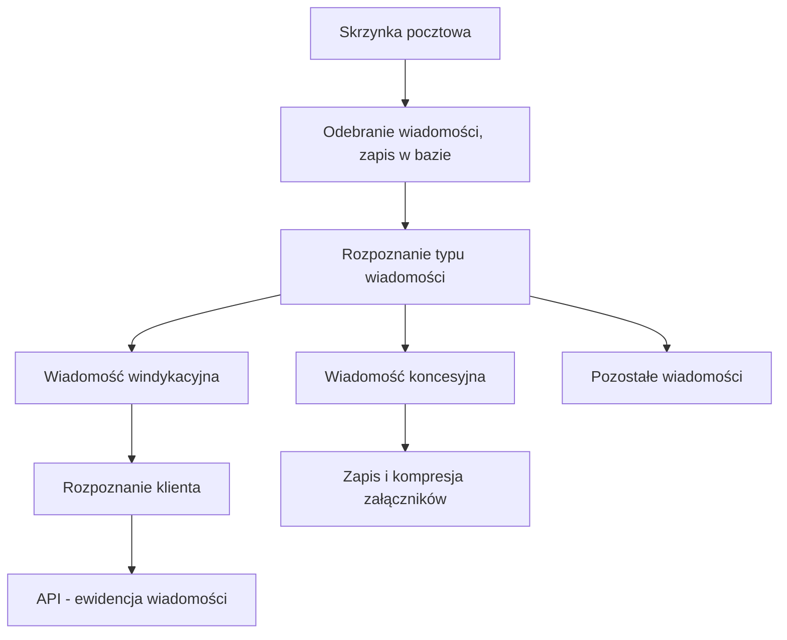
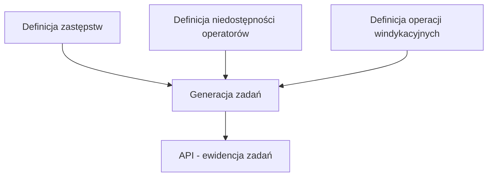
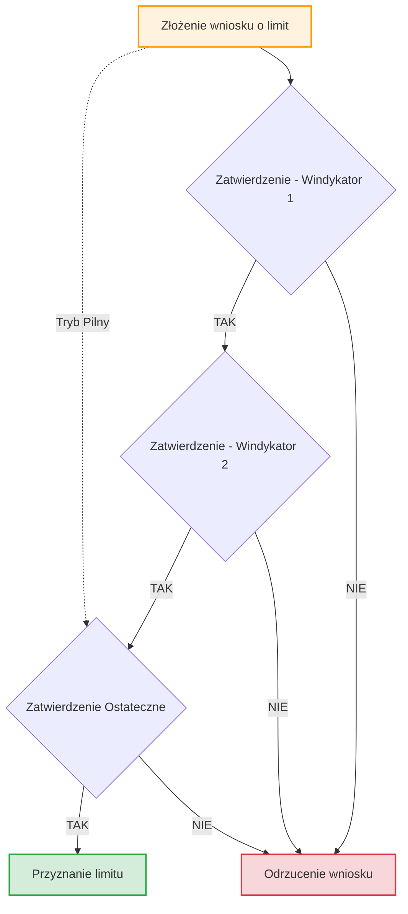
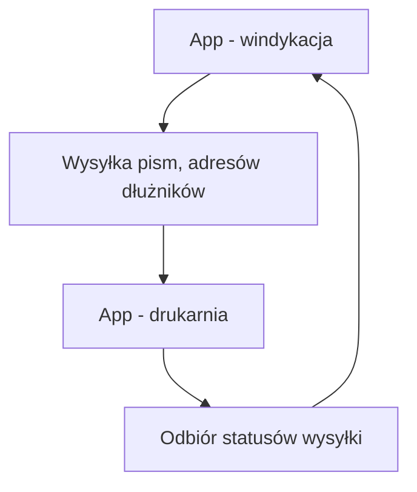

# Obsługa windykacyjna
**Enterprise Debt Collection & Credit Risk Management System**

  
  
-orange)  
  
  

**Obsługa windykacyjna** to kompleksowy system klasy **back-office / enterprise**, wspierający procesy **windykacji należności** oraz **zarządzania ryzykiem kredytowym** klientów biznesowych.
Aplikacja została zaprojektowana jako następca wygaszonego systemu **Debby**, z naciskiem na automatyzację, skalowalność oraz pełną audytowalność procesów decyzyjnych.

System obsługuje pełny cykl życia klienta:  
od monitorowania zadłużenia → przez działania windykacyjne → po zarządzanie limitami kredytowymi i integrację z systemami zewnętrznymi (SFA / SAP).

🔐 **Autoryzacja i bezpieczeństwo**
- Logowanie użytkowników odbywa się poprzez **Active Directory (Windows Authentication)**  
- Uprawnienia są mapowane na role systemowe i workflow decyzyjne  
- Pełna separacja dostępu na poziomie danych, modułów i procesów

[Komentarz kierownika działu windykacji](https://lnkd.in/dJXQyrbz)

---

## 🚀 Kluczowe funkcjonalności

### 1. Moduł operacyjny: Ewidencja i realizacja zadań

Centralnym elementem systemu jest **inteligentny silnik dystrybucji pracy**, który automatyzuje tworzenie oraz obsługę zadań windykacyjnych.

- **Automatyczna generacja zadań**  
  Zadania tworzone są cyklicznie przez procesy backgroundowe na podstawie:
  - poziomu zadłużenia,
  - liczby dni po terminie płatności,
  - przypisanego schematu windykacyjnego.

- **Obsługa zastępstw**  
  System dynamicznie przepisuje zadania w przypadku:
  - urlopu,
  - choroby,
  - czasowej niedostępności windykatora.

- **Interaktywna karta klienta**  
  Centralny punkt pracy umożliwiający:
  - realizację połączeń telefonicznych,
  - wysyłkę SMS i e-mail,
  - generowanie pism,
  - pracę na dokumentach zadłużenia.

- **Outsourcing korespondencji papierowej**  
  Automatyczne przekazywanie pism do zewnętrznej drukarni wraz z monitorowaniem statusów doręczeń (feedback loop).

---

### 2. Moduł komunikacji: Inteligentna ewidencja wiadomości

Centralny rejestr korespondencji elektronicznej ściśle zintegrowany z procesami windykacyjnymi.

- **Background Services**  
  Automatyczne pobieranie wiadomości przychodzących i wychodzących.

- **Automatyczna identyfikacja klienta**  
  Powiązanie wiadomości z klientem na podstawie:
  - adresu e-mail,
  - numeru NIP,
  - numeru sprawy / wątku.

- **Zarządzanie wyjątkami**  
  Kolejka manualnej weryfikacji dla wiadomości nierozpoznanych jednoznacznie.

---

### 3. Moduł decyzyjny: Zarządzanie limitami kredytowymi

Zaawansowany moduł workflow do obsługi limitów kredytowych.

- **Wielopoziomowy proces decyzyjny**  
  Workflow zgodny z macierzą uprawnień (windykator → kierownik → decydent).

- **Fast Track / Tryb pilny**  
  Możliwość skrócenia ścieżki decyzyjnej przez użytkownika z najwyższymi uprawnieniami.

- **Model hybrydowy limitów**  
  Obsługa limitów:
  - stałych,
  - czasowych (np. sezonowych),
  które mogą współistnieć na koncie klienta.

- **Pełna historia decyzji**  
  Każdy krok zawiera decyzję, komentarz, załączniki oraz pełny ślad audytowy.

---

## 🛠 Warstwa techniczna i implementacja

System zaprojektowany w architekturze wielowarstwowej z wyraźną separacją odpowiedzialności.

### 1. Persistence Layer: SQL Server

- integralność transakcyjna,
- wysoka wydajność,
- optymalizacja pod procesy backgroundowe.

**Rozwiązania techniczne:**
- triggery biznesowe,
- indeksy filtrowane,
- separacja schematów bazodanowych.

> 📂 **Zasoby:** [Fragment struktury bazy danych (SQL)](Samples/sql/Table.sql)

---

### 2. Autorski silnik raportowy (.dr)

Dedykowany silnik raportowy oddzielający definicję danych od warstwy UI.

- dynamiczne szablony raportów (.dr),
- runtime parsing definicji,
- brak konieczności rekompilacji aplikacji.

> 📂 **Zasoby:**  
> [Przykład raportu (.dr)](Samples/RaportWykorzystaniaLimitow.dr)  
> [Opis systemu (PDF)](SystemRaportowy.pdf)

---

### 3. Integracje i komunikacja

- **GUS** – walidacja kontrahentów po NIP  
- **SFA / SAP** – synchronizacja limitów i zadłużenia  
- **Excel (OpenXML + LINQ)** – eksport danych bez Office Automation

---

## 📊 Schematy procesów (Workflows)

*Poniższy schemat ilustruje proces obsługi wiadomości email*

*Poniższy schemat ilustruje proces tworzenie zadania*

*Poniższy schemat ilustruje proces zatwierdzenie wniosku limitowego*

*Poniższy schemat ilustruje proces obsługi poczty tradycyjnej*

[🔙 Powrót do README](../../../README.md)